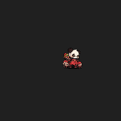
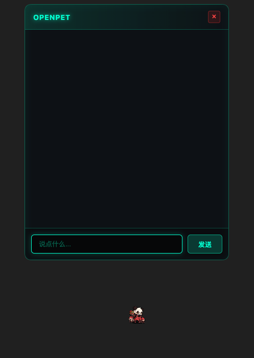
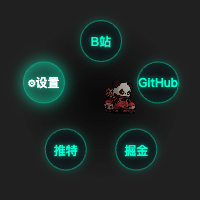
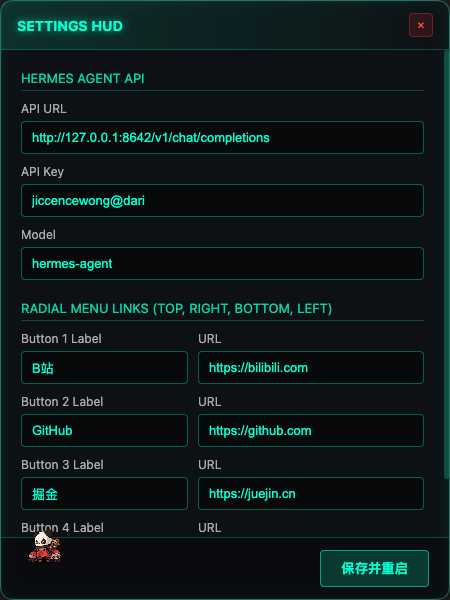

# OpenPet

Electron 桌面宠物与 AI 聊天伴侣


## 预览

### 主窗口 - 桌面宠物



### 聊天窗口 - 与 AI 对话



### 环形菜单 - 右键弹出



### 设置面板 - 配置 API 与链接



## 功能特性

- **透明桌宠**：无边框、可拖拽、始终置顶，融入桌面环境
- **动画引擎**：基于原生 JS 轮播图片实现序列帧动画，支持 12+ 种状态
- **AI 对话**：左键点击宠物唤出聊天窗口，直连本地 Hermes Agent
- **快捷菜单**：右键弹出环形菜单，快速访问网站/执行动作
- **全局快捷键**：
  - `Cmd/Ctrl+Shift+P`：显隐主窗口
  - `Cmd/Ctrl+Shift+T`：切换始终置顶
- **设置面板**：配置 API 参数与快捷菜单链接

## 内存占用

| 进程类型 | RSS (常驻内存) | VSZ (虚拟内存) |
|----------|---------------|---------------|
| 主进程 (Node) | ~154 MB | ~1.5 GB |
| 渲染进程 (BrowserWindow) | ~217 MB | ~454 MB |
| GPU 进程 | ~256 MB | ~1.5 GB |
| **总计** | **~627 MB** | **~2.4 GB** |

> 测试环境：macOS 14.4, Apple M1 Pro, 空闲状态

## 依赖环境

- Node.js 18+
- [Hermes Agent](https://github.com/mostly-ai/hermes-agent) API (默认监听 `http://localhost:8642/v1/chat/completions`)

## 运行

```bash
# 安装依赖
npm install

# 启动应用
npm start
```

## 开发

```bash
# 构建应用
npm run build

# 构建产物位于 dist/ 目录
```

## 项目结构

```
OpenPet/
├── main.js              # Electron 主进程，窗口管理、IPC 通信
├── preload.js           # 主窗口预加载脚本
├── renderer.js          # 主窗口渲染逻辑，FSM 动画引擎
├── chat-preload.js      # 聊天窗口预加载脚本
├── chat-renderer.js     # 聊天窗口 UI 逻辑
├── settings-preload.js  # 设置窗口预加载脚本
├── settings-renderer.js # 设置窗口 UI 逻辑
├── index.html           # 主窗口 HTML
├── chat.html            # 聊天窗口 HTML
├── settings.html        # 设置窗口 HTML
├── public/
│   ├── sprites.json     # 精灵图帧数据
│   └── spritesheet.png  # 动画精灵图 (13MB)
├── config.json          # 运行时配置 (自动生成)
└── package.json
```

## 动画状态机

| 状态 | 动画 | 描述 |
|------|------|------|
| BORN | born | 初始出生动画 |
| IDLE | idle/block | 空闲状态，随机切换 |
| WANDER | move | 自主移动位置 |
| INTERACT | skill01/attack01-04/block/vertigo | 用户交互触发 |
| DRAGGING | suffer | 拖拽时的状态 |

## 技术栈

- **Electron** 28.0.0 - 桌面应用框架
- **Node.js** - 主进程逻辑
- **Canvas API** - 动画渲染
- **IPC** - 进程间通信
- **Axios** - HTTP 客户端

## 配置项

`config.json` (自动生成)：

```json
{
  "api_url": "http://127.0.0.1:8642/v1/chat/completions",
  "api_key": "your-api-key",
  "model": "hermes-agent",
  "links": [
    { "label": "B站", "url": "https://bilibili.com", "action": "skill01" },
    { "label": "GitHub", "url": "https://github.com", "action": "block" },
    { "label": "掘金", "url": "https://juejin.cn", "action": "vertigo" },
    { "label": "推特", "url": "https://twitter.com", "action": "attack01" }
  ]
}
```

## 下一步计划

- [ ] **动画增强**
  - 添加更多动作动画 (sleep, eat, jump)
  - 实现表情变化 (眼睛/嘴巴帧)
  - 添加粒子特效 (技能释放)

- [ ] **AI 能力扩展**
  - 支持多轮对话上下文管理
  - 添加语音输入/输出 (Web Speech API)
  - 集成图像理解能力

- [ ] **交互优化**
  - 添加触摸板手势支持
  - 实现宠物跟随鼠标/触摸
  - 添加更多环形菜单动作

- [ ] **性能优化**
  - 图片资源压缩与懒加载
  - 内存占用优化 (当前 ~630MB)
  - 支持多显示器定位

- [ ] **功能扩展**
  - 桌宠皮肤/换装系统
  - 成就系统与数据持久化
  - 跨平台同步配置

- [ ] **打包发布**
  - 生成安装包 (DMG/NSIS)
  - 代码签名与自动更新
  - 发布到 GitHub Releases

## 许可证

MIT
